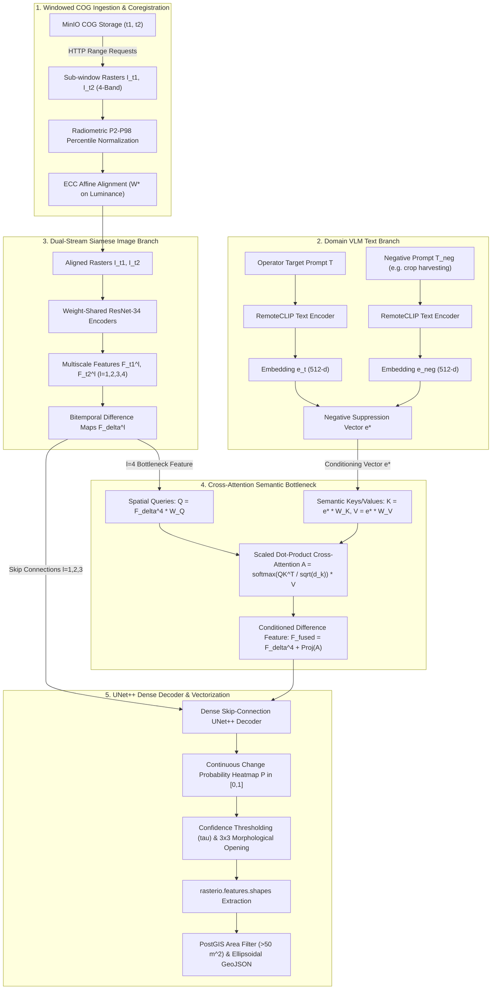

# GeoDelta Knowledge Base (MoD SIH26227)
## Semantic Retrieval and Multi-Temporal Change Analysis of Satellite Imagery

---

## 1. System Mission, Problem Identification & Military Operational Context

### 1.1 Mission & System Identity
- **System Name:** GeoDelta (Automated Geospatial Intelligence - GEOINT Platform)
- **Problem Statement ID:** SIH26227
- **Sponsoring Agency:** Ministry of Defence (MoD), Government of India
- **Architecture Paradigm:** Hybrid Dual-Stream Cross-Attention Siamese Network (Tactical Core - Solution B) & Topological Scene Graph-Delta Space (Enterprise Scaling Roadmap - Solution D)
- **Operating Environment:** Strict on-premise, air-gapped deployment with zero external internet dependencies or public map CDNs.
- **Primary Objective:** Enable defense intelligence operators to submit unstructured natural language queries over temporal satellite archives to retrieve, cross-align, and isolate verified tactical change signatures (e.g., newly graded airstrips, perimeter fortifications, artillery revetments, or unauthorized clearings) while computationally suppressing non-tactical seasonal, atmospheric, and agricultural noise.

### 1.2 User Classes & Operational Personas
1. **Tactical GEOINT Operator (Analyst):**
   - Submits plain-language operational search queries.
   - Explores target AOIs using the synchronized split-swipe dual viewport.
   - Interactively adjusts real-time confidence thresholds ($\tau$).
   - Validates vector polygons and compiles 1-click cryptographic intelligence dossiers.
2. **Strategic Intelligence Commander (Viewer / Auditor):**
   - Reviews theater-level activity logs and aggregate altered surface metrics ($m^2$, ha).
   - Validates cryptographic SHA-256 data integrity hashes.
   - Authorizes and releases official mission intelligence packages.
3. **Systems & GIS Administrator (Admin):**
   - Manages local Cloud-Optimized GeoTIFF (COG) storage and MinIO buckets.
   - Registers sensor calibration metadata and monitors GPU worker queues (Celery/Redis).

### 1.3 As-Is vs. To-Be Operational Shift
| Dimension | Legacy Manual GIS Workflow (As-Is) | GeoDelta Automated Platform (To-Be) |
| :--- | :--- | :--- |
| **Search Paradigm** | Coordinate / metadata queries only (cloud cover, sensor angles). | Unstructured semantic natural language queries (e.g. *"Show newly graded airstrip"*). |
| **Data Ingestion** | Full-scene gigabyte downloads ($>1\text{ GB}$ per GeoTIFF). | Sub-window HTTP range byte streaming from COGs without full download. |
| **Image Coregistration** | Unaligned or coarse manual control points; severe terrain edge artifacts. | Automated sub-pixel Enhanced Correlation Coefficient (ECC) maximization ($W^*$). |
| **False-Positive Handling** | Naive differencing flags vegetation dry-off, crop harvesting, and sun shadows. | Negative semantic suppression ($\mathbf{e}^*$) & cross-attention bottleneck filtering. |
| **Vector Delineation** | Manual operator hand-tracing in desktop GIS software. | Automated morphological opening + `rasterio.features.shapes` vector extraction. |
| **Area Calculation** | Estimated or manual planar measurements. | Deterministic ellipsoidal geodesic computation (`ST_Area(geom::geography)` in $m^2$). |
| **Reporting** | Manual Word/PDF assembly taking hours. | 1-click automated PDF intelligence dossier with cryptographic SHA-256 proofs. |
| **Operational Latency** | 4 to 8 hours per target sector. | **$< 15\text{ seconds}$** end-to-end response time. |

---

## 2. Five Immutable Remote-Sensing Physical Laws & Guardrails for GEOINT

Autonomous agents and engineers developing the GeoDelta platform must strictly adhere to five foundational remote-sensing physical laws. Violating these laws leads to false alarms, corrupted feature alignments, or generative hallucinations.

### Law 1: The Nyquist-Shannon GSD Resolution Invariant
- **Formula:** Any tactical entity of characteristic physical dimension $D$ requires:
  $$D \ge 2 \times \text{GSD}$$
- **Physical Rationale:** Under the Nyquist-Shannon sampling theorem, an object smaller than $2 \times \text{GSD}$ spans fewer than two discrete sensor detector elements, precluding structural shape reconstruction.
- **Sensor Feasibility Envelope:**
  - *Sentinel-2 (10m GSD):* Minimum resolvable entity dimension is $20\text{ m}$. Vehicles (~4m), single trees (~3m), or individual artillery barrels (~5m) are sub-pixel artifacts. Suitable for airstrips, large bunkers, forward operating bases, and road grading.
  - *Cartosat-2S / Aerial ($0.5\text{m} - 0.65\text{m}$ GSD):* Resolvable dimension is $1.0\text{m} - 1.3\text{m}$. Individual vehicles, defensive berms, and structural revetments are resolvable.
- **Algorithmic Guardrail:** The ingestion gateway must intercept natural language queries that attempt to detect or delineate sub-Nyquist entities relative to the target raster's native GSD, raising `FeasibilityStatus.REJECTED_SUB_NYQUIST` prior to triggering neural inference.

### Law 2: 16-Bit Radiometric Normalization Invariant
- **Problem:** Operational satellite GeoTIFFs are delivered as 12-to-16-bit unsigned integers (`uint16`). Naive min-max normalization (`x / 65535.0` or `x / 255.0`) crushes dynamic contrast due to sensor saturation, specular water reflections, and sensor nodata flags (0 or 65535).
- **Percentile Normalization Formulation:** Compute the 2nd and 98th cumulative percentiles exclusively over valid, non-zero pixel data:
  $$I_{\text{norm}} = \text{clip}\left(\frac{I - P_2}{P_{98} - P_2}, 0.0, 1.0\right)$$
- **Preservation Contract:** The normalized tensor feeds the VLM and Siamese neural backbones, while raw radiometric band arrays are preserved for spectral ratio calculations.

### Law 3: Sub-Pixel Coregistration & ECC Alignment
- **Problem:** Orbital trajectory variations between temporal passes ($t_1, t_2$) introduce sub-pixel spatial misalignments. Direct difference computation without coregistration creates spurious high-frequency false-positive edge lines along ridgelines, coastlines, and road boundaries.
- **ECC Maximization Formulation:** Find the optimal 2D affine warp transformation matrix $W^*$:
  $$W^* = \arg\max_W \text{ECC}\left(I_{t_1}^{\text{lum}}, \mathcal{W}(I_{t_2}^{\text{lum}}; W)\right)$$
  Where $I^{\text{lum}}$ is the panchromatic/luminance channel ($0.299R + 0.587G + 0.114B$).
- **Registration Guardrail:** If the computed correlation coefficient falls below **$0.65$**, the pipeline trips `RegistrationFailureException` and aborts processing, preventing false edge alerts.

### Law 4: Spectral Independence & Optical Cloud Cover Guardrail
- **Problem:** Cloud cover and dense cirrus shadows create massive reflectance changes that mimic terrain excavation.
- **Rule:** Optical scenes must be evaluated using the Scene Classification Layer (SCL) or QA60 cloud mask band:
  $$\text{CloudRatio}_{\text{AOI}} = \frac{\sum_{(x,y) \in \text{AOI}} \mathbb{I}(\text{pixel is cloud/cirrus})}{\text{Total Pixels}_{\text{AOI}}}$$
- **Circuit Breaker:** If $\text{CloudRatio}_{\text{AOI}} > 0.35$ (35%), the system aborts optical inference, raises `CloudCoverExceededException`, and alerts the operator to switch to SAR imagery (e.g., Sentinel-1 / RISAT-1 C-band).

### Law 5: Separation of Arithmetic from Generative Language
- **Problem:** Large language models and VLMs consistently hallucinate spatial areas, metric surface measurements, and geographic coordinates.
- **Mandate:** All spatial geometries, ground surface footprints ($m^2$, ha), and centroid coordinates must be computed deterministically via PostGIS ellipsoidal formulas and discrete raster math:
  $$\text{Area}_{\text{ellipsoidal}} = \text{ST\_Area}(\text{geom::geography})$$
  $$\text{Area}_{\text{pixels}} = N_{\text{positive\_pixels}} \times (\text{GSD})^2$$
- **Verbalization Contract:** The language model is strictly restricted to verbalizing pre-calculated database metrics. It must never perform autonomous mathematical calculations or guess metric dimensions.

---

## 3. Deep Learning Architecture & Mathematical Formulations (Solution B Core)



### 3.1 Input Tensor Conditioning
- **Input Channels:** 4 Bands (Red, Green, Blue, Near-Infrared - NIR) at timestamp $t_1$ and $t_2$:
  $$I_{t_1}, I_{t_2} \in \mathbb{R}^{4 \times H \times W}$$
- **Luminance Channel for ECC:**
  $$I^{\text{lum}} = 0.299 \cdot I^{(R)} + 0.587 \cdot I^{(G)} + 0.114 \cdot I^{(B)}$$

### 3.2 Vision-Language Conditioning & Contextual Disambiguation
- **RemoteCLIP Text Encoder:** Frozen ViT-B/32 text transformer pre-trained on 800k remote-sensing image-caption pairs, projecting prompts into a 512-dimensional normalized hypersphere:
  $$\mathbf{e}_t = \frac{\text{RemoteCLIP}(T)}{\|\text{RemoteCLIP}(T)\|_2} \in \mathbb{R}^{1 \times 512}$$
  $$\mathbf{e}_{\text{neg}} = \frac{\text{RemoteCLIP}(T_{\text{neg}})}{\|\text{RemoteCLIP}(T_{\text{neg}})\|_2} \in \mathbb{R}^{1 \times 512}$$
- **Negative Semantic Suppression Vector:**
  $$\mathbf{e}^* = \frac{\mathbf{e}_t - \beta \mathbf{e}_{\text{neg}}}{\|\mathbf{e}_t - \beta \mathbf{e}_{\text{neg}}\|_2}, \quad \beta \in [0.4, 0.8] \text{ (default } 0.65\text{)}$$
  *Effect:* Mathematically cancels directional projections corresponding to agricultural harvesting, seasonal drying, or shadow changes from the active conditioning vector.

### 3.3 Siamese Multiscale Feature Pyramids
- Weight-shared ResNet-34 encoders extract visual representations across 4 resolution stages:
  $$\mathbf{F}_{t_1}^l, \mathbf{F}_{t_2}^l \in \mathbb{R}^{C_l \times \frac{H}{2^{l+1}} \times \frac{W}{2^{l+1}}}, \quad l \in \{1, 2, 3, 4\}$$
  Where $C_1=64, C_2=128, C_3=256, C_4=512$.
- **Bitemporal Difference Fusion:**
  $$\mathbf{F}_{\Delta}^l = \text{Conv}_{1 \times 1}\left(\left[\mathbf{F}_{t_1}^l \mathbin{\Vert} \mathbf{F}_{t_2}^l \mathbin{\Vert} |\mathbf{F}_{t_1}^l - \mathbf{F}_{t_2}^l|\right]\right) \in \mathbb{R}^{C_l \times H_l \times W_l}$$

### 3.4 Cross-Attention Semantic Modulation
At the stage $l=4$ bottleneck ($C_4 = 512, H_4 = H/32, W_4 = W/32$):
1. **Query Projection (Spatial Vision):** Flatten spatial grid to sequence length $N = H_4 \times W_4$:
   $$Q = \text{Reshape}(\mathbf{F}_{\Delta}^4) \cdot W_Q \in \mathbb{R}^{N \times d_k}, \quad d_k = 512$$
2. **Key / Value Projection (Language):**
   $$K = \mathbf{e}^* \cdot W_K \in \mathbb{R}^{1 \times d_k}, \quad V = \mathbf{e}^* \cdot W_V \in \mathbb{R}^{1 \times d_k}$$
3. **Scaled Dot-Product Attention:**
   $$\mathbf{A} = \text{softmax}\left(\frac{Q K^T}{\sqrt{d_k}}\right) V \in \mathbb{R}^{N \times d_k}$$
4. **Residual Spatial Fusion:**
   $$\mathbf{F}_{\text{fused}} = \mathbf{F}_{\Delta}^4 + \text{Reshape}(\mathbf{A} \cdot W_O) \in \mathbb{R}^{512 \times H_4 \times W_4}$$

### 3.5 Dense UNet++ Decoder & Probability Mapping
- Dense skip connections concatenate multi-scale difference features $\mathbf{F}_{\Delta}^1, \mathbf{F}_{\Delta}^2, \mathbf{F}_{\Delta}^3$ with upsampled representations.
- Final $1 \times 1$ convolution with Sigmoid activation outputs continuous probability:
  $$P(Y=1 \mid I_{t_1}, I_{t_2}, T, T_{\text{neg}}) \in [0.0, 1.0]^{H \times W}$$

### 3.6 Counter-Factual Query Execution Caching
- **Invariant:** When an analyst re-queries the same AOI with a contrasting prompt (e.g., toggling from *"Show runway extension"* to *"Show unpaved trenching"*), the system **MUST NOT** reload rasters or re-run ResNet-34 visual backbones.
- **Cache Contract:** Feature pyramids $\mathbf{F}_{t_1}^l, \mathbf{F}_{t_2}^l$ are cached in Redis / GPU VRAM keyed by `aoi_hash + t1_timestamp + t2_timestamp`.
- **Re-Execution:** Only the RemoteCLIP text projection, bottleneck cross-attention, and UNet++ decoder are re-executed, completing counter-factual re-queries in **$< 150\text{ ms}$**.

---

## 4. Post-Processing & Deterministic Vector Footprint Engine

### 4.1 Morphological Noise Suppression
1. Continuous probability map $P$ is binarized against threshold $\tau$ (default $\tau = 0.70$):
   $$B(x, y) = \begin{cases} 1 & \text{if } P(x, y) \ge \tau \\ 0 & \text{otherwise} \end{cases}$$
2. A $3 \times 3$ morphological opening filter (erosion followed by dilation) removes isolated single-pixel anomalies:
   $$B_{\text{clean}} = (B \ominus K_{3\times 3}) \oplus K_{3\times 3}$$

### 4.2 High-Throughput Vectorization
- `rasterio.features.shapes` converts connected positive pixel components into GeoJSON MultiPolygon geometries in native raster coordinates.
- Geometries are reprojected from raster pixel space to **WGS 84 (EPSG:4326)** via affine transform matrix.

### 4.3 Deterministic PostGIS Geodesic Calculations
- Polygons are ingested into PostgreSQL/PostGIS.
- **Surface Area Calculation ($m^2$ and Hectares):**
  ```sql
  SELECT 
      id,
      ST_Area(geom::geography) AS area_sq_m,
      ST_Area(geom::geography) / 10000.0 AS area_hectares,
      ST_AsGeoJSON(geom) AS geojson
  FROM detected_changes
  WHERE ST_Area(geom::geography) >= 50.0;
  ```
- **Clutter Filter:** Polygons with ground surface area $< 50\text{ m}^2$ are strictly dropped to eliminate sub-tactical surface noise.

---

## 5. Fault-Tolerance, Resiliency & Circuit Breakers

| Exception / Condition | Trigger Criterion | Automated System Response | Operator Message |
| :--- | :--- | :--- | :--- |
| `CloudCoverExceededException` | Optical cloud/cirrus cover $> 35\%$ within AOI. | Abort optical pipeline immediately; flush memory buffers. | `"Cloud cover exceeds 35% threshold. Optical analysis unreliable. Switch to Sentinel-1 SAR imagery."` |
| `RegistrationFailureException` | Sub-pixel ECC correlation score $< 0.65$. | Abort neural forward pass to prevent false terrain edge lines. | `"Image registration failed (ECC < 0.65). Orbital convergence error. Re-select clear reference scene."` |
| `GPUOutOfMemoryHandler` | `torch.cuda.OutOfMemoryError` caught during forward pass. | Clear `torch.cuda.empty_cache()`, invoke dynamic 4-way overlapping quadtree tiling. | `"Large AOI detected: processing via 4-tile overlapping quadtree split."` |
| `FeasibilityStatus.REJECTED_SUB_NYQUIST` | Entity dimension $D < 2 \times \text{GSD}$. | Intercept query at gateway; return physics rejection. | `"Requested entity is below sensor resolution limit (Nyquist violation for 10m GSD)."` |
| `DeterministicFallbackMode` | CUDA device unavailable or GPU worker timeout ($>12\text{s}$). | Dispatch job to OpenCV/NumPy Otsu spectral differencing pipeline on CPU. | `"Running in Deterministic CPU Fallback Mode. Results based on adaptive spectral change differencing."` |

### GPU OOM Dynamic 4-Way Overlapping Quadtree Tiling
When an AOI raster exceeds GPU VRAM capacity:
1. Split the $H \times W$ raster into 4 quadrants with **$10\%$ spatial border overlap** to prevent edge boundary clipping:
   - Tile 1 (NW): $[0 : H/2 + \delta, \quad 0 : W/2 + \delta]$
   - Tile 2 (NE): $[0 : H/2 + \delta, \quad W/2 - \delta : W]$
   - Tile 3 (SW): $[H/2 - \delta : H, \quad 0 : W/2 + \delta]$
   - Tile 4 (SE): $[H/2 - \delta : H, \quad W/2 - \delta : W]$
   Where $\delta = 0.10 \times \min(H/2, W/2)$.
2. Sequentially process each quadrant through the cross-attention network.
3. Blend overlapping probability regions using linear feathering weights:
   $$P_{\text{overlap}} = w \cdot P_{\text{tile}_A} + (1 - w) \cdot P_{\text{tile}_B}$$
4. Vectorize the composite seamless probability map.

---

## 6. Presentation Layer & Tactical Geospatial UI Specifications

### 6.1 Design Tokens & Military Aesthetic
- **Theme:** High-contrast tactical dark interface (`RESTRICTED // GEOINT ASSESSMENT`).
- **Color Palette:**
  - Base Background: Slate Gunmetal (`#0b0f19`) / Card Surface (`#111827`)
  - Border Accents: Tactical Steel (`#1f2937`) / HUD Divider (`#374151`)
  - Tactical Breaches & Construction: Crimson Alert (`#ef4444`) / Amber Warning (`#f59e0b`)
  - Verified Change Polygons: High-Contrast Emerald (`#10b981`)
  - Primary Action / Crosshair: Cyan Tactical (`#06b6d4`)
- **Typography:** JetBrains Mono for coordinates/metrics; Inter for UI controls.

### 6.2 Synchronized Split-Swipe Viewport (MapLibre GL JS + deck.gl)
- **Viewport Layout:** Single MapLibre canvas running synchronized pre-event ($t_1$) on the left and post-event ($t_2$) on the right.
- **Vertical Split-Swipe Slider:** Linked to mouse/pointer horizontal coordinate ($X_{\text{cursor}}$), rendering custom clipping masks:
  ```javascript
  // MapLibre Canvas Split-Swipe Clipping Logic
  const clipX = mouseX / containerWidth;
  layerT1.setClipRect([0, 0, clipX, 1.0]);
  layerT2.setClipRect([clipX, 0, 1.0, 1.0]);
  ```
- **Vector Overlay Layer:** Detected change polygons rendered continuously across both sides using deck.gl `GeoJsonLayer`, with fill color modulated by detection confidence:
  $$\text{RGBA} = \left[239, 68, 68, \text{clamp}(\tau \times 255, 80, 230)\right]$$

### 6.3 Real-Time Interactive Controls & Inspection HUD
- **Confidence Slider ($\tau \in [0.30, 0.95]$):** Directly re-filters active deck.gl vector layers client-side in $\le 16\text{ ms}$ without issuing round-trip backend inference calls.
- **Polygon Click Inspector:** Selecting any polygon displays an operational HUD card containing:
  - Tactical Classification (e.g., `"Unpaved Roadway Extension"`)
  - Confidence Score (e.g., `"94.2%"`)
  - Centroid Coordinates in WGS 84 (`"28.6139° N, 77.2090° E"`) and MGRS (`"43R BK 21458 64789"`)
  - Ground Surface Area (`"14,250 m² (1.425 ha)"`)
  - Temporal Delta Window (`"15 Jan 2025 → 10 Jun 2025"`)

---

## 7. Cryptographic Intelligence Dossier Engine (FR-EXP)

### 7.1 Automated 1-Click PDF Compilation
The platform includes an automated reporting engine built with ReportLab / PyMuPDF. Clicking *"Export Intelligence Dossier"* compiles and downloads a publication-grade PDF report in **$\le 3.0\text{ seconds}$**.

### 7.2 Dossier Structure & Evidence Integrity
1. **Classification Banners:** Top and bottom headers marked `RESTRICTED // GEOINT ASSESSMENT // FOR OFFICIAL USE ONLY`.
2. **Executive Metadata Summary:**
   - Operation Identifier & Query String
   - Target AOI Name and Bounding Box
   - Sensor Modality & Acquisition Dates ($t_1, t_2$)
   - Analyst Call-Sign & Generation Timestamp (UTC)
3. **Visual Evidence Chips:** Side-by-side cropped high-resolution visual chips:
   - Panel A: Pre-Event Scene ($t_1$)
   - Panel B: Post-Event Scene ($t_2$)
   - Panel C: Extracted Vector Change Overlay over Post-Event Scene
4. **Quantitative Tactical Metrics Table:**
   - Total Altered Ground Surface ($m^2$ and ha)
   - Number of Verified Distinct Structural Entities
   - Spatial Coordinates of Detected Centroids (WGS 84 & MGRS)
5. **Cryptographic Chain of Custody:**
   - SHA-256 hash computed over the raw source GeoTIFF bytes for $t_1$ and $t_2$.
   - SHA-256 hash of the generated vector GeoJSON feature collection.
   - Prevents tampering and ensures admissibility in military review boards.

---

## 8. Enterprise Scaling Architecture (Solution D - Production / Q&A Defense)

For theater-wide border surveillance ($> 50,000\text{ km}^2$), brute-force deep learning on every query wastes massive GPU compute. The system architecture defines an enterprise scaling roadmap based on **Topological Scene Graph Deltas**:

```mermaid
flowchart LR
    A["Raw Regional Satellite Archive (t1, t2)"] --> B["Offline Worker: SAM-Geo Instance Segmentation"]
    B --> C["Vector Primitives: Buildings, Roads, Berms (Nodes V)"]
    C --> D["Spatial Connectivity: Delaunay Triangulation (Edges E)"]
    D --> E["Scene Knowledge Graphs: G_t1 = (V1, E1), G_t2 = (V2, E2)"]
    E --> F["Graph Set-Difference Operator: Delta_G = G_t2 \\ G_t1"]
    F --> G["Neo4j Graph Database: Sub-millisecond Cypher Spatial Query"]
    G -->|Candidate Changed Tiles Only| H["Solution B Cross-Attention GPU Inference"]
```



### 8.1 Topological Scene Graph Formulation
- **Nodes ($V$):** Spatial objects extracted offline via SAM-Geo with semantic attributes:
  $$v_i = \{\text{id}, \text{class\_type}, \text{centroid\_wgs84}, \text{area\_m2}, \text{perimeter\_m}, \text{aspect\_ratio}\}$$
- **Edges ($E$):** Spatial relationships and proximity networks computed via Delaunay Triangulation and Voronoi tessellation:
  $$e_{ij} = \{\text{source\_id}, \text{target\_id}, \text{relation\_type} \in [\text{'adjacent'}, \text{'connected\_by\_road'}, \text{'within\_500m'}], \text{distance\_m}\}$$

### 8.2 Discrete Graph Delta ($\Delta G$)
$$\Delta G = G_{t_2} \ominus G_{t_1} = (V_{t_2} \setminus V_{t_1}) \cup (E_{t_2} \setminus E_{t_1}) \cup \{\Delta \text{Attributes}(V_{t_1} \cap V_{t_2})\}$$

### 8.3 Sub-Millisecond Cypher Spatial Traversals
Natural language structural queries are parsed into Cypher graph queries:
```cypher
MATCH (b:Structure)-[:CONNECTED_BY_ROAD]->(r:Airstrip)
WHERE b.timestamp = '2025-06-10' 
  AND NOT (b)-[:EXISTS_AT]->(:Epoch {date: '2025-01-15'})
  AND b.area_m2 >= 50.0
RETURN b.centroid, b.area_m2, r.id;
```
*Latency Benefit:* Evaluates an entire $50,000\text{ km}^2$ border sector in **$< 15\text{ ms}$** over Neo4j, activating GPU inference exclusively on the isolated candidate sub-tiles.

---

## 9. Pydantic v2 Data Contracts & Schemas

The following validated Python data contracts govern all internal pipelines, API endpoints, and worker tasks:

```python
"""
Pydantic v2 Data Contracts for GeoDelta GEOINT Platform
Enforces strict typing, validation, and zero-hallucination data exchange.
"""

from datetime import datetime
from typing import List, Optional, Tuple, Dict, Any
from enum import Enum
from pydantic import BaseModel, Field, field_validator


class UserRole(str, Enum):
    ANALYST = "ROLE_ANALYST"
    COMMANDER = "ROLE_COMMANDER"
    ADMIN = "ROLE_ADMIN"


class FeasibilityStatus(str, Enum):
    FEASIBLE = "FEASIBLE"
    REJECTED_SUB_NYQUIST = "REJECTED_SUB_NYQUIST"
    REJECTED_CLOUD_COVER = "REJECTED_CLOUD_COVER"
    REJECTED_REGISTRATION_FAILURE = "REJECTED_REGISTRATION_FAILURE"


class BoundingBoxAOI(BaseModel):
    min_lat: float = Field(..., ge=-90.0, le=90.0, description="Southern latitude boundary")
    max_lat: float = Field(..., ge=-90.0, le=90.0, description="Northern latitude boundary")
    min_lon: float = Field(..., ge=-180.0, le=180.0, description="Western longitude boundary")
    max_lon: float = Field(..., ge=-180.0, le=180.0, description="Eastern longitude boundary")

    @field_validator("max_lat")
    def validate_latitude_order(cls, v: float, values: Any) -> float:
        if "min_lat" in values.data and v <= values.data["min_lat"]:
            raise ValueError("max_lat must be strictly greater than min_lat")
        return v

    @field_validator("max_lon")
    def validate_longitude_order(cls, v: float, values: Any) -> float:
        if "min_lon" in values.data and v <= values.data["min_lon"]:
            raise ValueError("max_lon must be strictly greater than min_lon")
        return v


class InferenceRequest(BaseModel):
    query_text: str = Field(..., min_length=3, max_length=256, description="Natural language target query")
    negative_query: Optional[str] = Field(None, max_length=256, description="Negative context for suppression")
    aoi: BoundingBoxAOI = Field(..., description="Geographic boundary of the target AOI")
    t1_date: datetime = Field(..., description="Pre-event satellite acquisition timestamp")
    t2_date: datetime = Field(..., description="Post-event satellite acquisition timestamp")
    confidence_threshold: float = Field(default=0.70, ge=0.30, le=0.95, description="Initial mask threshold tau")
    cloud_threshold_percent: float = Field(default=35.0, ge=5.0, le=50.0, description="Maximum permitted cloud ratio")


class CounterFactualRequest(BaseModel):
    task_id: str = Field(..., description="Original inference job ID referencing cached visual tensors")
    new_query_text: str = Field(..., min_length=3, max_length=256, description="New contrasting query prompt")
    new_negative_query: Optional[str] = Field(None, max_length=256, description="Updated negative context")
    confidence_threshold: float = Field(default=0.70, ge=0.30, le=0.95)


class RegistrationMetrics(BaseModel):
    ecc_score: float = Field(..., ge=0.0, le=1.0, description="Enhanced Correlation Coefficient score")
    warp_matrix: List[List[float]] = Field(..., description="2x3 Affine transformation matrix")
    registration_converged: bool = Field(..., description="Flag indicating ECC convergence")


class DetectedPolygonFeature(BaseModel):
    feature_id: str = Field(..., description="Unique UUID for detected polygon")
    tactical_class: str = Field(..., description="Predicted tactical entity classification")
    confidence: float = Field(..., ge=0.0, le=1.0, description="Mean confidence score within polygon boundary")
    area_sq_meters: float = Field(..., ge=50.0, description="Ellipsoidal ground footprint in square meters")
    area_hectares: float = Field(..., ge=0.005, description="Ground footprint in hectares")
    centroid_wgs84: Tuple[float, float] = Field(..., description="(Latitude, Longitude) of centroid")
    centroid_mgrs: str = Field(..., description="MGRS 10-figure grid coordinate")
    geometry_geojson: Dict[str, Any] = Field(..., description="Valid GeoJSON MultiPolygon dictionary")


class ExecutionTrace(BaseModel):
    task_id: str = Field(..., description="Unique Celery job ID")
    execution_time_ms: float = Field(..., description="Total end-to-end latency in milliseconds")
    stage_latencies_ms: Dict[str, float] = Field(..., description="Breakdown of timing per pipeline stage")
    device_used: str = Field(..., description="Execution device (e.g. 'NVIDIA GeForce RTX 4060' or 'CPU')")
    execution_mode: str = Field(..., description="'DEEP_LEARNING_SIAMESE' or 'DETERMINISTIC_FALLBACK'")
    t1_sha256: str = Field(..., description="SHA-256 cryptographic hash of t1 source GeoTIFF bytes")
    t2_sha256: str = Field(..., description="SHA-256 cryptographic hash of t2 source GeoTIFF bytes")


class InferenceResponse(BaseModel):
    task_id: str = Field(..., description="Job identifier")
    status: FeasibilityStatus = Field(..., description="Feasibility and completion status")
    total_area_altered_sq_m: float = Field(..., description="Aggregate altered ground footprint area")
    total_features_detected: int = Field(..., description="Count of discrete vector change polygons")
    polygons: List[DetectedPolygonFeature] = Field(..., description="List of detected georeferenced polygons")
    trace: ExecutionTrace = Field(..., description="Auditable telemetry and execution trace")


class DossierExportRequest(BaseModel):
    task_id: str = Field(..., description="Completed inference job ID")
    analyst_callsign: str = Field(default="ANALYST-ALPHA", max_length=64)
    classification_level: str = Field(default="RESTRICTED // GEOINT ASSESSMENT")
    notes: Optional[str] = Field(None, max_length=1000)
```

---

## 10. Repository Blueprint & Directory Layout

```
d:/Geo Delta - SIH/
├── GeoDelta.md                       # Formal Software Requirements Specification (v1.1.0)
├── Knowledgebase.md                  # This knowledge base and operational manual
├── docker-compose.yml                # Multi-service air-gapped container orchestration
├── .env.example                      # Environment template (PostgreSQL, MinIO, Redis keys)
├── backend/
│   ├── Dockerfile                    # Python 3.11 + CUDA 12.1 runtime image
│   ├── pyproject.toml                # Poetry/Pip dependencies (Torch, GDAL, Rasterio, FastAPI)
│   ├── app/
│   │   ├── __init__.py
│   │   ├── main.py                   # FastAPI application entrypoint & middleware
│   │   ├── config.py                 # Configuration settings via pydantic-settings
│   │   ├── api/
│   │   │   ├── deps.py               # Dependency injection (Auth, DB, Redis)
│   │   │   └── v1/
│   │   │       ├── router.py         # Main API router aggregation
│   │   │       ├── endpoints/
│   │   │       │   ├── auth.py       # JWT authentication & RBAC endpoints
│   │   │       │   ├── inference.py  # /analyze and /counterfactual endpoints
│   │   │       │   ├── dossier.py    # /dossier/export PDF generation endpoint
│   │   │       │   └── tiles.py      # TiTiler proxy & local XYZ streaming
│   │   │       └── websockets/
│   │   │           └── progress.py   # WebSocket status streamer (/ws/v1/tasks/{task_id})
│   │   ├── core/
│   │   │   ├── schemas.py            # Pydantic v2 data models & validation contracts
│   │   │   ├── exceptions.py         # Custom circuit breaker exception hierarchy
│   │   │   └── security.py           # JWT token generation & password hashing
│   │   ├── db/
│   │   │   ├── session.py            # SQLAlchemy async session engine
│   │   │   └── models.py             # PostgreSQL tables (AuditLog, ChangeFeatures)
│   │   ├── services/
│   │   │   ├── cog_streamer.py       # Windowed HTTP byte-range reader for COGs
│   │   │   ├── coregistration.py     # Sub-pixel ECC affine alignment engine
│   │   │   ├── vlm_encoder.py        # RemoteCLIP text projector & negative suppressor
│   │   │   ├── siamese_engine.py     # ResNet-34 + Cross-Attention + UNet++ forward pass
│   │   │   ├── vectorizer.py         # rasterio polygonizer & PostGIS area calculator
│   │   │   ├── fallback_engine.py    # Deterministic OpenCV/NumPy CPU fallback
│   │   │   └── dossier_generator.py  # ReportLab 1-click cryptographic PDF builder
│   │   └── workers/
│   │       ├── celery_app.py         # Celery task queue initialization
│   │       └── tasks.py              # Async GPU inference task definitions
│   └── tests/
│       ├── test_schemas.py           # Unit tests for Pydantic v2 contracts
│       ├── test_ecc.py               # Alignment tests on synthetic shifted rasters
│       ├── test_cross_attention.py   # Tensor shape & attention weight tests
│       └── test_e2e_pipeline.py      # End-to-end integration test suite
├── frontend/
│   ├── Dockerfile                    # Node.js 20 LTS container
│   ├── package.json                  # Next.js 14, MapLibre GL, deck.gl, Tailwind CSS
│   ├── tsconfig.json
│   ├── src/
│   │   ├── app/
│   │   │   ├── layout.tsx            # Tactical dark root layout
│   │   │   ├── page.tsx              # Main dashboard view
│   │   │   └── globals.css           # Tactical design tokens & Tailwind utilities
│   │   ├── components/
│   │   │   ├── HeaderBar.tsx         # Classification marker, prompt bar, date range
│   │   │   ├── SplitSwipeViewer.tsx  # MapLibre + deck.gl synchronized split-swipe canvas
│   │   │   ├── OperationsHUD.tsx     # Area metrics ($m^2$), count, real-time tau slider
│   │   │   ├── PolygonInspector.tsx  # Feature popup card (WGS84, MGRS, area)
│   │   │   └── StatusBar.tsx         # GPU VRAM monitor, coordinates, task status
│   │   ├── hooks/
│   │   │   ├── useTaskStream.ts      # WebSocket progress hook
│   │   │   └── useInference.ts       # React Query inference mutations
│   │   └── types/
│   │       └── index.ts              # TypeScript mirrors of Pydantic schemas
└── storage/
    ├── models/                       # Local model weights (air-gapped)
    │   ├── remoteclip/               # RemoteCLIP-ViT-B-32.pt
    │   └── siamese_backbone/         # ResNet-34 / LEVIR-CD pre-trained checkpoints
    └── samples/                      # Sample synthetic or real Sentinel-2 COGs
```

---

## 11. Operational Rules for Code Generation

Autonomous agents and engineers developing the GeoDelta platform must adhere to these non-negotiable coding standards:

1. **Zero-Placeholder Invariant:** Never emit `# TODO`, `# Placeholder`, `pass`, or truncated snippets in production files. Write complete, robust, production-grade implementations with error handling.
2. **Type Safety & Schema Validation:** Every incoming API request, internal inter-module message, and outgoing payload must be validated via Pydantic v2 models.
3. **Resiliency & Zero-Crash Demo Guarantee:** Every deep learning execution path must be wrapped in a fallback handler that activates `DeterministicFallbackMode` (OpenCV adaptive spectral differencing) if CUDA resources fail or time out.
4. **Deterministic Area Calculations:** Never compute polygon areas in JavaScript on the client side or via language models. All surface footprints must be calculated via PostGIS `ST_Area(geom::geography)` and expressed in square meters ($m^2$) and hectares.
5. **Air-Gapped Compliance:** Never include public CDN links (e.g. `unpkg.com`, `cdnjs.cloudflare.com`) in HTML or JS templates. All assets, fonts, and scripts must be bundled locally.
