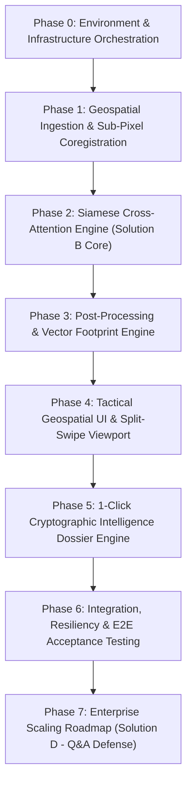

# GeoDelta Production Phases & Engineering Roadmap
## Automated Geospatial Intelligence (GEOINT) Platform — SIH26227
**Sponsoring Agency:** Ministry of Defence (MoD), Government of India  
**Architecture:** Hybrid Dual-Stream Cross-Attention Siamese Network (Tactical Core) & Topological Scene Graph-Delta Space (Enterprise Scaling Roadmap)  
**Standard Compliance:** [GeoDelta.md](file:///d:/Geo%20Delta%20-%20SIH/GeoDelta.md) (SRS v1.0.0/v1.1.0) & [Knowledgebase.md](file:///d:/Geo%20Delta%20-%20SIH/Knowledgebase.md)

---

## Executive Overview & Phasing Strategy

The production of the GeoDelta platform is organized into **8 sequential engineering phases**. This roadmap establishes a direct bridge between the foundational requirements in [GeoDelta.md](file:///d:/Geo%20Delta%20-%20SIH/GeoDelta.md) and the operational contracts in [Knowledgebase.md](file:///d:/Geo%20Delta%20-%20SIH/Knowledgebase.md).



---

## Phase 0: Environment Provisioning, Data Pipelines & Container Infrastructure

### 0.1 Objective
Establish an air-gapped, reproducible multi-container developer and runtime environment with zero outbound internet dependencies, local object storage, GPU-accelerated PyTorch runtime, PostGIS database, and task orchestration queues.

### 0.2 Target Deliverables & Artifacts
- `docker-compose.yml`: Multi-container orchestration (`db`, `redis`, `minio`, `titiler`, `api`, `worker`, `web`).
- `backend/Dockerfile`: Base Python 3.11 with CUDA 12.1, PyTorch 2.2, GDAL 3.8, Rasterio 1.3, OpenCV Headless.
- `frontend/Dockerfile`: Node.js 20 LTS standalone container.
- `storage/samples/`: Curated Sentinel-2 L2A optical 10m COG tiles and LEVIR-CD benchmark test pairs.
- `storage/models/`: Local pre-trained model weight cache (`RemoteCLIP-ViT-B-32.pt`, ResNet-34 ImageNet/LEVIR-CD Siamese checkpoints).
- `.env.example`: Air-gapped database credentials, MinIO S3 endpoints, Redis URIs, and JWT secret keys.

### 0.3 Key Technical Tasks
1. **Container Infrastructure Initialization:**
   - Configure PostgreSQL 16 container with PostGIS 3.4 and pgvector extensions.
   - Configure MinIO local S3 object store on ports `9000` (API) and `9001` (Console) with local persistent buckets: `cog-rasters`, `dossiers`, `model-weights`.
   - Configure Redis on port `6379` as Celery broker and result backend.
   - Configure TiTiler dynamic tile proxy on internal port `8001` to stream XYZ tiles directly from MinIO.
2. **Model Weight Staging & Integrity Verification (NFR-SEC-003):**
   - Download and verify SHA-256 checksums for `RemoteCLIP-ViT-B-32.pt` and ResNet-34 Siamese checkpoints.
   - Store verified weights under `storage/models/` for offline container mounting.
3. **Sample Dataset Staging:**
   - Pre-package multi-temporal paired COGs (Sentinel-2 10m bands B02, B03, B04, B08) with internal overviews and tile pyramids ($512 \times 512$ tile size).
   - Ingest LEVIR-CD building change detection benchmark pairs into MinIO for validation splits.

### 0.4 Acceptance Criteria & Verification
- `docker compose up --build` bootstraps all 7 services without errors under an offline network configuration (`nmcli networking off` or severed gateway).
- MinIO health check returns HTTP 200; PostgreSQL accepts PostGIS geography queries (`SELECT ST_Area(ST_MakePoint(0,0)::geography);`).
- PyTorch detects NVIDIA GPU: `python -c "import torch; assert torch.cuda.is_available()"` returns exit code 0.

---

## Phase 1: Geospatial Ingestion, Radiometric Normalization & Sub-Pixel Coregistration

### 1.1 Objective
Implement the high-throughput geospatial ingestion pipeline capable of reading sub-window COG byte ranges directly from MinIO over HTTP Range requests, enforcing the Nyquist-Shannon resolution law, applying 16-bit percentile normalization, and executing sub-pixel ECC coregistration.

### 1.2 Target Deliverables & Artifacts
- `backend/app/services/cog_streamer.py`: Windowed HTTP byte-range reader reading exclusively the bounding box AOI without full raster download (FR-GEO-001).
- `backend/app/services/normalizer.py`: Radiometric $P_2\text{--}P_{98}$ percentile dynamic range scaler (Law 2).
- `backend/app/services/coregistration.py`: OpenCV Enhanced Correlation Coefficient (ECC) affine alignment engine (FR-GEO-003).
- `backend/app/core/guardrails.py`: Nyquist-Shannon GSD feasibility checker and optical cloud occlusion circuit breaker (Law 1, Law 4, NFR-SAFE-001, NFR-SAFE-002).

### 1.3 Key Technical Tasks
1. **COG HTTP Range Streamer (FR-GEO-001):**
   - Compute raster pixel coordinates matching the user AOI bounding box `BoundingBoxAOI(min_lat, max_lat, min_lon, max_lon)`.
   - Issue windowed HTTP GET byte-range requests via Rasterio / GDAL virtual file system (`/vsicurl/`) to extract $4$-band sub-arrays ($I_{t_1}, I_{t_2} \in \mathbb{R}^{4 \times H \times W}$) without reading off-AOI bytes.
2. **Radiometric Percentile Normalization (Law 2):**
   - Ingest 16-bit unsigned integer arrays (`uint16`).
   - Filter out nodata (0, 65535); calculate cumulative 2nd and 98th percentiles per channel:
     $$I_{\text{norm}} = \text{clip}\left(\frac{I - P_2}{P_{98} - P_2}, 0.0, 1.0\right)$$
   - Retain raw arrays for subsequent physical index analysis.
3. **Cloud Occlusion Guardrail (Law 4 & NFR-SAFE-001):**
   - Parse Sentinel-2 SCL or QA60 band. Calculate cloud/cirrus pixel ratio over AOI.
   - If cloud cover $> 35\%$, trip `CloudCoverExceededException` and notify client via WebSocket.
4. **Sub-Pixel ECC Coregistration (FR-GEO-003 & Law 3):**
   - Synthesize panchromatic luminance band: $I^{\text{lum}} = 0.299R + 0.587G + 0.114B$.
   - Compute optimal 2D affine warp matrix $W^* = \arg\max_W \text{ECC}(I_{t_1}^{\text{lum}}, \mathcal{W}(I_{t_2}^{\text{lum}}; W))$ via `cv2.findTransformECC`.
   - If correlation score $< 0.65$, raise `RegistrationFailureException` to prevent false-positive terrain edge lines.
   - Warp 4-band tensor $I_{t_2}$ using $W^*$ to achieve sub-pixel alignment with $I_{t_1}$.

### 1.4 Acceptance Criteria & Verification
- Unit test `test_cog_streamer.py`: Verifies that byte transfer size for a $1024 \times 1024$ sub-window is $< 15\text{ MB}$, compared to $> 800\text{ MB}$ for a full Sentinel-2 scene.
- Unit test `test_ecc_alignment.py`: Applies artificial 3.5-pixel shift and 1.2-degree rotation to synthetic raster; verifies ECC restores spatial alignment with residual RMSE $< 0.25$ pixels and correlation $\ge 0.85$.
- Cloud cover check correctly rejects synthetic tile with $40\%$ cloud mask.

---

## Phase 2: Dual-Stream Siamese Network & Semantic Cross-Attention Engine (Solution B Core)

### 2.1 Objective
Construct and validate the deep learning core comprising frozen RemoteCLIP text projection with negative semantic suppression, weight-shared multiscale ResNet-34 Siamese encoders, bottleneck cross-attention modulation, dense UNet++ decoder, and feature caching for instant counter-factual query re-evaluation.

### 2.2 Target Deliverables & Artifacts
- `backend/app/services/vlm_encoder.py`: RemoteCLIP ViT-B/32 text embedding engine with negative suppression vector $\mathbf{e}^*$ (FR-NLQ-002, FR-NLQ-003).
- `backend/app/services/siamese_engine.py`: PyTorch neural module combining ResNet-34, cross-attention bottleneck, and UNet++ decoder (FR-INF-001, FR-INF-002).
- `backend/app/services/feature_cache.py`: In-memory / Redis cache storing extracted feature pyramids for $<150\text{ ms}$ counter-factual re-queries (FR-NLQ-004).

### 2.3 Key Technical Tasks
1. **RemoteCLIP Text Embedding & Negative Suppression (FR-NLQ-002, FR-NLQ-003):**
   - Tokenize prompt $T$ and negative prompt $T_{\text{neg}}$ (e.g., *"seasonal agriculture"*, *"sun angle shadow"*).
   - Encode prompts into unit-normalized 512-dimensional vectors $\mathbf{e}_t, \mathbf{e}_{\text{neg}}$.
   - Compute negative suppression conditioning vector:
     $$\mathbf{e}^* = \frac{\mathbf{e}_t - \beta \mathbf{e}_{\text{neg}}}{\|\mathbf{e}_t - \beta \mathbf{e}_{\text{neg}}\|_2}, \quad \beta = 0.65$$
2. **Weight-Shared Siamese Feature Pyramid Extraction (FR-INF-001):**
   - Pass co-registered tensors $I_{t_1}, I_{t_2} \in \mathbb{R}^{4 \times H \times W}$ through weight-shared ResNet-34 encoders.
   - Extract multi-scale feature hierarchies at stages $l \in \{1, 2, 3, 4\}$:
     $$\mathbf{F}_{t_1}^l, \mathbf{F}_{t_2}^l \in \mathbb{R}^{C_l \times \frac{H}{2^{l+1}} \times \frac{W}{2^{l+1}}}, \quad C \in \{64, 128, 256, 512\}$$
   - Assemble bitemporal difference feature maps:
     $$\mathbf{F}_{\Delta}^l = \text{Conv}_{1\times 1}\left(\left[\mathbf{F}_{t_1}^l \mathbin{\Vert} \mathbf{F}_{t_2}^l \mathbin{\Vert} |\mathbf{F}_{t_1}^l - \mathbf{F}_{t_2}^l|\right]\right)$$
3. **Cross-Attention Semantic Bottleneck Modulation (FR-INF-001):**
   - At bottleneck stage $l=4$ ($C_4 = 512, N = H_4 \times W_4$):
     $$Q = \text{Reshape}(\mathbf{F}_{\Delta}^4) W_Q \in \mathbb{R}^{N \times 512}$$
     $$K = \mathbf{e}^* W_K \in \mathbb{R}^{1 \times 512}, \quad V = \mathbf{e}^* W_V \in \mathbb{R}^{1 \times 512}$$
     $$\mathbf{A} = \text{softmax}\left(\frac{Q K^T}{\sqrt{512}}\right) V \in \mathbb{R}^{N \times 512}$$
     $$\mathbf{F}_{\text{fused}} = \mathbf{F}_{\Delta}^4 + \text{Reshape}(\mathbf{A} W_O)$$
4. **Dense UNet++ Decoder (FR-INF-002):**
   - Restore spatial resolution via nested dense skip pathways fusing $\mathbf{F}_{\Delta}^1, \mathbf{F}_{\Delta}^2, \mathbf{F}_{\Delta}^3$ with upsampled bottleneck features.
   - Final $1 \times 1$ conv + Sigmoid outputs continuous probability map $P \in [0.0, 1.0]^{H \times W}$.
5. **Counter-Factual Caching Engine (FR-NLQ-004):**
   - Cache feature pyramids $\mathbf{F}_{t_1}, \mathbf{F}_{t_2}$ keyed by `aoi_hash + t1 + t2`.
   - On counter-factual query, re-run only RemoteCLIP projection, bottleneck cross-attention, and UNet++ decoder, completing in $< 150\text{ ms}$.

### 2.4 Acceptance Criteria & Verification
- Unit test `test_cross_attention.py`: Validates tensor shapes across all intermediate stages for $1024 \times 1024$ input.
- Benchmarking test: Forward pass on NVIDIA RTX 3060/4060 completes in $\le 3.5\text{ seconds}$ for $1024 \times 1024$ image pair.
- Validation split on LEVIR-CD: Precision $\ge 0.88$, Recall $\ge 0.84$, IoU $\ge 0.78$, F1-Score $\ge 0.86$.
- Counter-factual query re-evaluation runs in $< 150\text{ ms}$ without accessing raw raster files.

---

## Phase 3: Post-Processing, Vectorization & Geodesic Footprint Engine

### 3.1 Objective
Translate continuous raster probability heatmaps into clean, discrete vector polygon geometries, compute exact ellipsoidal ground footprints ($m^2$ and hectares) via PostGIS, filter sub-tactical surface clutter, and format features for dynamic geospatial delivery.

### 3.2 Target Deliverables & Artifacts
- `backend/app/services/vectorizer.py`: Morphological filtering, `rasterio.features.shapes` vector extraction, and GeoJSON conversion (FR-VEC-001, FR-VEC-002).
- `backend/app/services/footprint_calculator.py`: PostGIS ellipsoidal area calculation (`ST_Area(geom::geography)`) and sub-tactical clutter filter (FR-VEC-003, FR-VEC-004).
- `backend/app/db/models.py`: SQLAlchemy models for persistent spatial storage (`detected_changes`, `audit_logs`).

### 3.3 Key Technical Tasks
1. **Morphological Noise Suppression (FR-VEC-001):**
   - Binarize continuous probability map against initial threshold $\tau$ (default $0.70$).
   - Apply $3 \times 3$ morphological opening filter:
     $$B_{\text{clean}} = (B \ominus K_{3\times 3}) \oplus K_{3\times 3}$$
   - Eliminates single-pixel noise and isolated sensor edge artifacts.
2. **High-Throughput Vector Extraction (FR-VEC-002):**
   - Invoke `rasterio.features.shapes` with 8-connectivity over $B_{\text{clean}}$.
   - Transform polygon coordinates from pixel coordinates $(r, c)$ to geographic coordinates (WGS 84 / EPSG:4326) using raster affine transformation matrix.
3. **Deterministic PostGIS Footprint Computation (FR-VEC-003, FR-VEC-004, Law 5):**
   - Insert polygons into PostGIS table:
     ```sql
     INSERT INTO detected_changes (task_id, tactical_class, confidence, geom)
     VALUES (:task_id, :tactical_class, :confidence, ST_GeomFromGeoJSON(:geojson));
     ```
   - Compute ellipsoidal geodesic area:
     ```sql
     SELECT 
         id,
         ST_Area(geom::geography) AS area_sq_m,
         ST_Area(geom::geography) / 10000.0 AS area_hectares,
         ST_Y(ST_Centroid(geom)) AS lat,
         ST_X(ST_Centroid(geom)) AS lon
     FROM detected_changes
     WHERE ST_Area(geom::geography) >= 50.0;
     ```
   - Automatically discard geometries with area $< 50\text{ m}^2$ to suppress sub-tactical clutter.
   - Convert WGS 84 coordinates to 10-figure MGRS string using `mgrs` library.

### 3.4 Acceptance Criteria & Verification
- Unit test `test_vectorizer.py`: Tests vectorization of a known synthetic square of $10 \times 10$ pixels at 10m GSD ($10,000\text{ m}^2$ nominal area). Verifies PostGIS ellipsoidal calculation matches expected geodesic area within $0.5\%$ error margin.
- Clutter filter test: Confirms that polygons $< 50\text{ m}^2$ are excluded from the output feature collection.
- Vector generation latency $\le 800\text{ ms}$ for 500 candidate polygons.

---

## Phase 4: Tactical Defense Web Dashboard & Split-Swipe Dual Viewport

### 4.1 Objective
Construct an interactive, high-contrast tactical web interface featuring synchronized dual-viewport split-swipe exploration, real-time client-side confidence filtering ($\tau \in [0.30, 0.95]$), polygon click inspection cards, and WebSocket task status monitoring.

### 4.2 Target Deliverables & Artifacts
- `frontend/src/app/page.tsx`: Main tactical GEOINT operations dashboard.
- `frontend/src/components/HeaderBar.tsx`: Classification marker (`RESTRICTED // GEOINT ASSESSMENT`), prompt input field, acquisition date pickers, and run trigger.
- `frontend/src/components/SplitSwipeViewer.tsx`: MapLibre GL JS + deck.gl synchronized split-swipe canvas (FR-UI-001, FR-UI-002, FR-UI-003).
- `frontend/src/components/OperationsHUD.tsx`: Area altered card ($m^2$, ha), detection counter, and real-time confidence slider (FR-INF-003).
- `frontend/src/components/PolygonInspector.tsx`: Polygon inspector panel showing classification, confidence, WGS84, MGRS, and area (FR-UI-004).
- `frontend/src/components/StatusBar.tsx`: Coordinate HUD (Lat/Lon/MGRS), GPU VRAM indicator, and Celery task status.

### 4.3 Key Technical Tasks
1. **Tactical Design System & Ergonomics:**
   - Configure Tailwind CSS with tactical military color tokens: Slate Gunmetal (`#0b0f19`), Card Surface (`#111827`), Tactical Steel (`#1f2937`), Crimson Alert (`#ef4444`), Emerald Verified (`#10b981`), and Cyan Reticle (`#06b6d4`).
   - Implement JetBrains Mono for telemetry/coordinates and Inter for controls.
2. **Synchronized Split-Swipe Viewport (FR-UI-002):**
   - Initialize MapLibre GL instance loading local vector tiles from TiTiler.
   - Configure split-screen raster layers: Pre-event ($t_1$) on the left, post-event ($t_2$) on the right.
   - Bind vertical divider slider to mouse/touch horizontal axis ($X_{\text{cursor}}$), dynamically setting scissor/clip rectangles on MapLibre tile layers:
     ```typescript
     const handleSwipeMove = (clientX: number) => {
       const rect = containerRef.current.getBoundingClientRect();
       const splitPos = Math.max(0, Math.min(1, (clientX - rect.left) / rect.width));
       setSplitPosition(splitPos);
       map.setLayerClip('raster-t1', [0, 0, splitPos, 1]);
       map.setLayerClip('raster-t2', [splitPos, 0, 1, 1]);
     };
     ```
3. **Dynamic Vector Layer & Real-Time Confidence Slider (FR-UI-003, FR-INF-003):**
   - Render detected change polygons via deck.gl `GeoJsonLayer` continuous across the swipe divider.
   - Style polygons with fill color opacity mapped to confidence:
     $$\text{RGBA} = \left[239, 68, 68, \text{clamp}(\text{confidence} \times 255, 80, 230)\right]$$
   - Connect client-side confidence slider ($\tau \in [0.30, 0.95]$) to deck.gl data filter, re-rendering in $\le 16\text{ ms}$ ($> 60\text{ FPS}$) without re-calling backend APIs.
4. **Polygon Inspection Panel (FR-UI-004):**
   - On polygon click, highlight polygon boundary in high-contrast cyan and display popup card:
     - Tactical Classification (e.g. `"Reinforced Perimeter Revetment"`)
     - Confidence Score (e.g. `"92.4%"`)
     - Central Coordinates (WGS 84: `34.1234° N, 74.5678° E`; MGRS: `43R BK 12345 67890`)
     - Ground Surface Area (`18,400 m² (1.84 ha)`)
5. **WebSocket Task Telemetry:**
   - Listen on `/ws/v1/tasks/{task_id}` for execution progress:
     $$\text{COG Windowing} \rightarrow \text{ECC Alignment} \rightarrow \text{VLM Inference} \rightarrow \text{Vectorization} \rightarrow \text{Complete}$$

### 4.4 Acceptance Criteria & Verification
- Split-swipe slider moves smoothly at $\ge 45\text{ FPS}$ with 2,500 active polygons rendered via deck.gl.
- Adjusting confidence slider instantaneously filters polygons without UI lag or network requests.
- Selecting a polygon renders the inspection HUD card with matching WGS84, MGRS, and area metrics.

---

## Phase 5: 1-Click Cryptographic Intelligence Dossier Engine

### 5.1 Objective
Construct an automated reporting engine generating a publication-grade military intelligence dossier (PDF format) upon a single user interaction in $\le 3.0\text{ seconds}$, incorporating classification banners, cropped high-resolution optical chips, vector change overlays, metric tables, and SHA-256 evidence chain-of-custody checksums.

### 5.2 Target Deliverables & Artifacts
- `backend/app/services/dossier_generator.py`: ReportLab / PyMuPDF automated document compilation engine (FR-EXP-001).
- `backend/app/services/chip_extractor.py`: High-resolution bounding chip cropper extracting localized optical chips for $t_1, t_2$.
- `backend/app/services/crypto_proof.py`: SHA-256 evidence chain-of-custody hashing utility for raw GeoTIFF tiles and output vectors.
- `backend/app/api/v1/endpoints/dossier.py`: REST endpoint `POST /api/v1/dossier/export` returning binary PDF stream.

### 5.3 Key Technical Tasks
1. **Evidence Chip Extraction:**
   - Extract localized high-resolution bounding chips ($512 \times 512$ or $1024 \times 1024$) centered on the most critical detected change clusters for $t_1$ and $t_2$.
   - Generate composited change overlay chip showing red-highlighted change boundaries over $t_2$ base imagery.
2. **Cryptographic Proof Computation (FR-EXP-001):**
   - Compute SHA-256 checksum over source GeoTIFF bytes for $t_1$ and $t_2$:
     $$\text{Hash}_{t_1} = \text{SHA256}(\text{bytes}_{t_1}), \quad \text{Hash}_{t_2} = \text{SHA256}(\text{bytes}_{t_2})$$
   - Compute SHA-256 checksum over the output GeoJSON feature collection.
   - Embed checksums into the PDF header and metadata table for forensic chain of custody.
3. **Document Layout & Military Styling:**
   - Top and bottom classification banners: `RESTRICTED // GEOINT ASSESSMENT // FOR OFFICIAL USE ONLY`.
   - Section 1: Executive Briefing & Operation Identifiers (Task ID, Analyst Call-Sign, Timestamps, Target AOI Bounding Box).
   - Section 2: Side-by-side optical chips (Panel A: Pre-Event $t_1$; Panel B: Post-Event $t_2$; Panel C: Vector Change Overlay).
   - Section 3: Quantitative Intelligence Breakdown table (Feature ID, Tactical Class, Confidence, Area $m^2$, Area ha, Centroid WGS84, Centroid MGRS).
   - Section 4: Cryptographic Evidence Block (SHA-256 hashes, signing timestamp).
4. **Vector Export Options (FR-EXP-002):**
   - Support raw vector export of all detected polygons as standard GeoJSON (`.geojson`) and zipped ESRI Shapefiles (`.shp`, `.shx`, `.dbf`, `.prj`).

### 5.4 Acceptance Criteria & Verification
- Test case TC-E2E-03: Clicking "Export Intelligence Dossier" compiles and downloads a valid PDF in $\le 3.0\text{ seconds}$.
- Verification script `verify_dossier.py`: Parses exported PDF, validates that SHA-256 checksums match source files exactly, and confirms table contains all detected polygon metrics.

---

## Phase 6: System Integration, Resiliency & End-to-End Acceptance Testing

### 6.1 Objective
Integrate all backend services, Celery worker queues, and frontend dashboards into a unified system, enforce all circuit breakers and fallback mechanisms, and validate the platform against the formal acceptance criteria in [GeoDelta.md](file:///d:/Geo%20Delta%20-%20SIH/GeoDelta.md).

### 6.2 Target Deliverables & Artifacts
- `backend/app/services/fallback_engine.py`: OpenCV/NumPy adaptive Otsu spectral differencing CPU fallback (zero-crash demo invariant).
- `backend/app/workers/tasks.py`: Celery async worker task definitions with GPU OOM quadtree tiling recovery.
- `backend/tests/test_e2e_pipeline.py`: Comprehensive test suite implementing formal test cases TC-E2E-01 through TC-E2E-04.

### 6.3 Key Technical Tasks
1. **Resiliency & Fault-Tolerance Enforcement:**
   - **Cloud Circuit Breaker (NFR-SAFE-001):** Verify pipeline trips on $>35\%$ cloud cover and suggests SAR.
   - **ECC Registration Guard (NFR-SAFE-002):** Verify pipeline aborts when correlation $<0.65$.
   - **GPU OOM Quadtree Tiling (NFR-SAFE-003):** Wrap PyTorch inference in try/except block; on `torch.cuda.OutOfMemoryError`, clear CUDA cache and divide AOI into 4 quadrants with $10\%$ spatial overlap, process sequentially, and blend probability seams.
   - **Deterministic Fallback Engine:** If CUDA is unavailable or worker times out ($>12\text{ s}$), automatically dispatch job to CPU OpenCV/NumPy spectral differencing pipeline.
2. **Formal Integration Test Execution:**
   - **TC-E2E-01 (Counter-Factual Query Switching):**
     - Run prompt *"Identify newly paved runway extension"*; verify airstrip highlighted.
     - Switch prompt to *"Identify agricultural clearings"*; verify airstrip clears and clearings highlight in $<150\text{ ms}$ without raster re-download.
   - **TC-E2E-02 (Negative Semantic Suppression):**
     - Submit target *"Concrete construction"* with negative *"Seasonal soil moisture drying"*.
     - Verify attention map suppresses soil drying activations while preserving concrete foundations.
   - **TC-E2E-03 (1-Click Dossier Verification):**
     - Validate PDF generation latency $\le 3\text{ s}$ and SHA-256 hash match.
   - **TC-E2E-04 (Air-Gapped Operation):**
     - sever host network; run `docker compose up --build`; verify full application executes without network socket exceptions.

### 6.4 Acceptance Criteria & Verification
- End-to-end inference latency on $1024 \times 1024$ tile at 10m GSD $\le 8.0\text{ seconds}$ on an NVIDIA RTX 3060/4060 GPU.
- RemoteCLIP text embedding generation latency $\le 150\text{ ms}$.
- Model accuracy meets or exceeds: Precision $\ge 0.88$, Recall $\ge 0.84$, IoU $\ge 0.78$, F1-Score $\ge 0.86$.
- All 4 formal test cases pass with $100\%$ success rate.

---

## Phase 7: Enterprise Production Roadmap & Defense Readiness (Solution D)

### 7.1 Objective
Construct the enterprise scaling architecture (Solution D) based on Topological Scene Graph Deltas ($\Delta G$) to defend national-scale border surveillance ($> 50,000\text{ km}^2$) during technical judging Q&A.

### 7.2 Target Deliverables & Artifacts
- `enterprise/sam_extractor.py`: Offline batch worker script executing SAM-Geo instance segmentation across static rasters to extract vector primitives (nodes $V$) and road/proximity networks (edges $E$).
- `enterprise/graph_compiler.py`: Neo4j graph database populator building dual temporal Scene Graphs $G_{t_1}, G_{t_2}$ and compiling graph deltas $\Delta G$.
- `enterprise/cypher_queries.cql`: Curated Cypher query library translating natural language structural patterns into sub-millisecond graph traversals.
- `docs/ENTERPRISE_SCALING_DEFENSE.md`: Technical whitepaper and presentation slides for SIH judges detailing border-scale scaling mathematics.

### 7.3 Key Technical Tasks
1. **SAM-Geo Primitive Extraction:**
   - Run Segment Anything Geospatial (SAM-Geo) in offline batch mode over regional baselines.
   - Extract physical objects (nodes $V$): buildings, towers, graded areas, airstrips with attributes: `{id, class, centroid, area_m2, perimeter}`.
   - Compute spatial proximity network (edges $E$) via Delaunay Triangulation: `{source_id, target_id, relation_type, distance_m}`.
2. **Topological Scene Graph Delta Compilation:**
   - Persist temporal graph baselines $G_{t_1} = (V_1, E_1)$ and $G_{t_2} = (V_2, E_2)$ into Neo4j.
   - Formulate discrete set-difference delta:
     $$\Delta G = G_{t_2} \ominus G_{t_1} = (V_{t_2} \setminus V_{t_1}) \cup (E_{t_2} \setminus E_{t_1}) \cup \{\Delta \text{Attributes}\}$$
3. **Sub-Millisecond Border Screening via Cypher:**
   - Execute structural relationship queries over Neo4j:
     ```cypher
     MATCH (s:Structure)-[:NEAR {max_dist: 500}]->(r:Road)
     WHERE s.epoch = '2025-06' AND NOT (s)-[:EXISTED_IN]->(:Epoch {date: '2025-01'})
     RETURN s.bounding_box, s.area_m2;
     ```
   - *Technical Defense Argument for Judges:* Evaluates a $50,000\text{ km}^2$ national border sector in **$< 15\text{ ms}$**, identifying candidate sectors and invoking heavy GPU deep learning inference solely on verified candidate tiles.

### 7.4 Acceptance Criteria & Verification
- Cypher query execution across a 100,000-node synthetic border scene graph completes in $< 15\text{ ms}$.
- Comprehensive technical Q&A defense document ready for the SIH Grand Finale jury.

---

## Production Execution Schedule & Milestone Matrix

| Phase | Core Deliverable | Primary Modules Involved | Estimated Sprint Duration | Target Milestone |
| :--- | :--- | :--- | :--- | :--- |
| **Phase 0** | Air-Gapped Infrastructure & Data Staging | Docker, PostgreSQL, MinIO, Redis | Sprint 1 | Infrastructure Online & Air-Gapped |
| **Phase 1** | Geospatial Ingestion & Coregistration | `cog_streamer.py`, `coregistration.py` | Sprint 2 | Sub-Pixel ECC Coregistration Verified |
| **Phase 2** | Siamese Cross-Attention Engine | `siamese_engine.py`, `vlm_encoder.py` | Sprint 3 | Solution B AI Model Benchmark Met |
| **Phase 3** | Vectorization & PostGIS Footprints | `vectorizer.py`, `footprint_calculator.py` | Sprint 4 | Deterministic Geodesic $m^2$ Output |
| **Phase 4** | Tactical UI & Split-Swipe Viewport | Next.js 14, MapLibre GL, deck.gl | Sprint 5 | Interactive Dual-Viewport Functional |
| **Phase 5** | 1-Click Cryptographic Dossier | `dossier_generator.py`, PyMuPDF | Sprint 6 | Automated Signed PDF Export Ready |
| **Phase 6** | System Integration & Resiliency | Celery tasks, E2E tests, fallbacks | Sprint 7 | End-to-End System Integration Complete |
| **Phase 7** | Enterprise Scaling Architecture | Neo4j, SAM-Geo, Cypher queries | Sprint 8 | SIH Grand Finale Q&A Defense Ready |

---

## Traceability Matrix: Requirements to Production Phases

| Requirement ID | Description | Primary Phase | Verification Method |
| :--- | :--- | :--- | :--- |
| `FR-AUTH-001..003` | JWT RBAC & Immutable Audit Trail | Phase 0 & Phase 4 | Automated API integration tests |
| `FR-NLQ-001..002` | Unstructured Query & RemoteCLIP Embeddings | Phase 2 | Unit tests on 512-d normalized vectors |
| `FR-NLQ-003` | Contextual Disambiguation / Negative Suppression | Phase 2 | TC-E2E-02 negative context evaluation |
| `FR-NLQ-004` | Counter-Factual Query Execution | Phase 2 | TC-E2E-01 $<150\text{ ms}$ feature cache test |
| `FR-GEO-001` | COG HTTP Range Streamer | Phase 1 | Byte-transfer monitoring on AOI window |
| `FR-GEO-002` | Optical Cloud Masking ($\le 35\%$) | Phase 1 | `CloudCoverExceededException` trigger test |
| `FR-GEO-003` | Sub-Pixel ECC Coregistration | Phase 1 | Spatial correlation score $\ge 0.65$ test |
| `FR-INF-001` | Cross-Attention Siamese Network | Phase 2 | Forward pass tensor shape validation |
| `FR-INF-002` | Dense UNet++ Decoder Heatmap | Phase 2 | Continuous probability array output |
| `FR-INF-003` | Real-Time Confidence Threshold Slider | Phase 4 | Client-side deck.gl dynamic filtering |
| `FR-VEC-001` | $3 \times 3$ Morphological Opening Filter | Phase 3 | Binary mask noise suppression test |
| `FR-VEC-002` | Polygon Vectorization via rasterio | Phase 3 | GeoJSON MultiPolygon schema test |
| `FR-VEC-003` | PostGIS Ellipsoidal Area ($m^2$, ha) | Phase 3 | Geodesic area calculation against ground truth |
| `FR-VEC-004` | Sub-Tactical Clutter Suppression ($<50\text{ m}^2$) | Phase 3 | Minimum polygon area filter verification |
| `FR-UI-001` | Interactive Map Navigation (MapLibre) | Phase 4 | UI pan, zoom, pitch benchmark ($\ge 45\text{ FPS}$) |
| `FR-UI-002` | Split-Swipe Dual Viewport Slider | Phase 4 | Interactive scissor clipping verification |
| `FR-UI-003` | Color-Coded Confidence Polygons | Phase 4 | RGBA visual opacity gradient check |
| `FR-UI-004` | Polygon Click Inspector HUD Card | Phase 4 | Modal popup data matching PostGIS record |
| `FR-EXP-001` | 1-Click Cryptographic Intelligence Dossier | Phase 5 | PDF generation $\le 3\text{ s}$ + SHA-256 match |
| `FR-EXP-002` | Vector Export (GeoJSON & Shapefile) | Phase 5 | File download & GIS software import test |
| `FR-GRAPH-001..002` | SAM-Geo Scene Graphs & Cypher Deltas | Phase 7 | Neo4j $<15\text{ ms}$ Cypher traversal test |
| `NFR-PERF-001` | End-to-End Latency $\le 8.0\text{ s}$ on $1024 \times 1024$ | Phase 6 | Execution timer benchmark on GPU |
| `NFR-SAFE-001..003` | Circuit Breakers (Cloud, ECC, GPU OOM) | Phase 1 & Phase 6 | Exception raising & quadtree tiling recovery |
| `NFR-SEC-001..003` | Air-Gapped Operation & SHA-256 Checksums | Phase 0 & Phase 6 | Severed network boot & weight checksum check |
